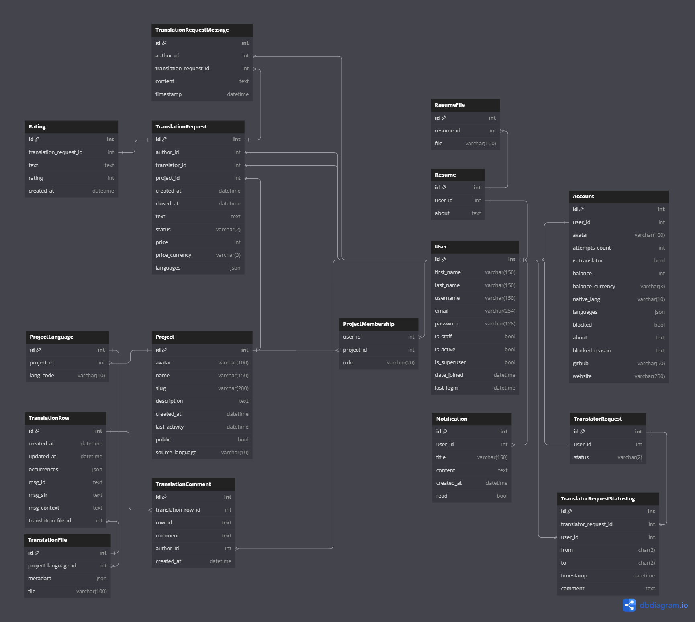

# Transletter

[](https://gitlab.crja72.ru/django_2023/projects/team16/-/pipelines)

## Cloning project

Run this git command

```cmd
> git clone git@gitlab.crja72.ru:django_2023/projects/team16.git
```

## ER Diagram



## Setup

### Creating virtual enviroment

#### Linux

```cmd
> pip install virtualenv
> virtualenv virtualenv_name
> source virtualenv_name/bin/activate
```

#### Windows

```cmd
> python -m venv venv
> venv\bin\activate
```

### Setup .env file

#### Linux

```cmd
> cp .env.template .env
```

#### Windows

```cmd
> copy .env.template .env
```

And change .env for your needs

### Installing requirements

#### Prod requirements installation

```cmd
> pip install -r requirements/prod.txt
```

#### Dev requirements installation

```cmd
> pip install -r requirements/dev.txt
```

#### Test requirements installation

```cmd
> pip install -r requirements/test.txt
```

## Creating translations

### Creating .po file for language

```cmd
> django-admin makemessages -l <lang_code>
```

### Compiling translations

```cmd
> django-admin compilemessages
```

## Preparing database

### Applying migrations

```cmd
> python manage.py migrate
```

### Loading fixtures

```cmd
> python manage.py loaddata fixtures/data.json
```

### Using bult-in command

```cmd
> python manage.py initdata
```

#### Parametrs

```cmd
--interactive - Add this to input superuser data in console instead of getting it from env
--skip-applying-migrations - Add this to stop loading migrations
--skip-loading-fixtures - Add this to stop loading fixtures
--skip-creating-superuser - Add this to stop creating superuser
```

## Collecting static

```cmd
> python manage.py collectstatic
```

## Dev run

```cmd
> python manage.py runserver
```

## Prod run

```cmd
> gunicorn transletter.wsgi
```
